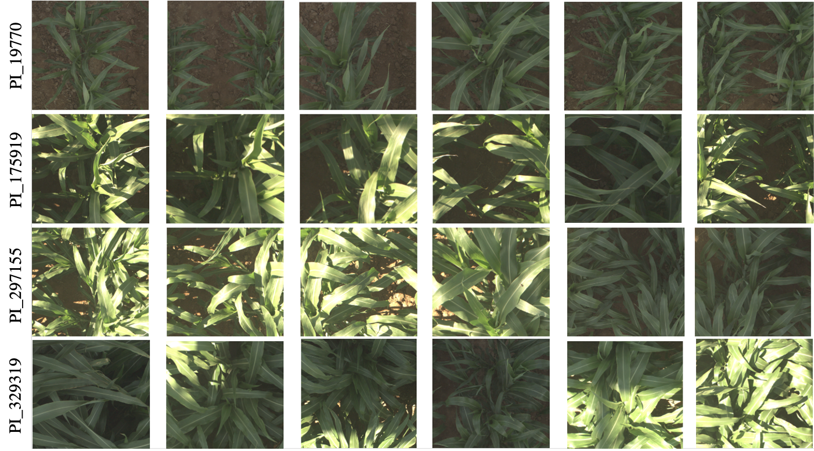

# Sorghum competition code using CI/CD
## Introduction

This repo contains the code for my submission for [Sorghum kaggle competition](https://www.kaggle.com/competitions/sorghum-id-fgvc-9 "Link to the sorghum image classification competition").   
**I ranked 29 (top 8 %)** in **only 2 weeks** (my competitors have been working on it for 3 months) using only a **single medium size GPU** (Nvidia 1080 TI)  
My goal on this project was not to spend a lot of time fine-tuning a complex solution (annotating extra data, customizing pipeline,..), but have a **simple yet effective approach** leading relatively quickly to **very good results**, using **simple methods** that I can **implement in a few hours**.  
As an engineer, I know that I have to focus on maintaining a **high quality Ml model while keeping the development cost (time) low**, so this is what this project intends to.  
I also used [CircleCI](https://circleci ) as a **CI/CD** tool on this project.   

## 1) The competition

[Sorghum kaggle competition](https://www.kaggle.com/competitions/sorghum-id-fgvc-9 "Link to the sorghum image classification competition") is an open image classification competition with more than 250 teams, where competitors have to correctly **classify images** from 100 different sorghum cultivars grown in June of 2017. 

 

*Some of the 100 sorghum class images to classify*

The Sorghum-100 dataset consists of 48,106 images and 100 different sorghum cultivars grown in June of 2017 (the images come from the middle of the growing season when the plants were quite large but not yet lodging -- or falling over).

Each image is taken using an RGB spectral camera taken from a vertical view of the sorghum plants in the TERRA-REF field in Arizona. Image are in png format and are 1024 x 1024 each. 

## 2) CircleCI

[CircleCI](https://circleci ) is as continuous integration / continuous development tool (CI/CD).   It has been founded in 2011 and it is now one of the most popular CICD platform. It is very similar to [buildkite](https://buildkite.com/ )   
 

Every time I merge a branch to my main branch, CircleCI will perform some test on my code to ensure everything is working fine. I configured my github account to make it impossible to commit to the main branch directly. 
I use pytest to perform my tests. I had to redefine which functions pytest had to test threw [pytest.ini](pytest.ini) file as some library I was importing (fastai) had some functions matching the default pytest behavior (probably a bad practice).   
I set up my github repo to make it impossible to merge a branch to the main branch if one or several circleCI test have failed.  
An other good thing about circleCI is that has it runs in docker container, so you are sure your repository contains a perfect description of your environent, as circleCI will have to reproduce it to test your code. 

## 3) Environment

My code is in Python3.7, you will find all my package in the requirement.txt [requirements.txt](requirements.txt) file.  
With conda, you just have to run : 
 > conda env create -f environment.yml  
 > conda activate $new_environment_name  
 > jupiter notebook  

 I am mainly using [Fastai](https://docs.fast.ai/), you can see it as a very good pytorch wrapper.  
 Fastai is developed especially for jupyter notebook (data visualization,... ) this is why my code in mainly in [main notebook](main_notebook.ipynb)

 ## 4) The competition

Now that we have our environment and CI/CD tools set up correctly, let's focus on the competition itself.  
A mention earlier, my goal here was to have a **simple yet effective approach** leading to **very good results**, using **simple methods** that I can **implement quickly**.  
I first used as very simple CNN, resnet18 that I can train quickly on some images (256*256). It is very handy as : 
- a small model is perfect to debug and iterate quickly
- it gave us a good baseline.

if I do more complex stuff resulting in a similar/lower model performance, **it is therefore very likely that I have a bug**  
 
### 4.1) Performances

Before we go further, let's optimize our code. Training a single takes a lot of time on my hardware (8 cores CPU only, nvidia1080 TI GPU)  
The first approach is to reduce the size of the dataset. Initially, I had 70 GB of data, each image having a size of 1024x1024. I use fastai resize_image functions to create 2 other dataset, of size 512 and 256. It might reduce the accuracy of the model, but : 
- It makes data loading way quicker (less data to load to the GPU)
- It makes the training way quicker
- We can develop our model on small images to try different data augmentation and then train it on bigger images.

I also converted my model from fp32 to fp16, reducing the GPU V-RAM footprint by 20% 
 

*the table below summarizes my results (using a basic resnet18)*

|Training strategy|Time for 1 epoch |
|------------------------------------------------------------------------------|------------------------------------------------------------------------------|
|Default strategy, image-size: 1024x1024|1 h 20 min|
|image-size: 512x512|24 min|
|image-size: 256x256|10 min|
 
### 4.2) Results

This competition use simple mean classification accuracy as evaluation metric. This is how we will evaluate our models.
 

|Training strategy|Classification accuracy on test-set (Kaggle leaderboard)  |
|------------------------------------------------------------------------------|------------------------------------------------------------------------------|
|Resnet18 256x256 with no data-augmentation |0.581|
|Resnet18 256x256 with data-augmentation |0.593|
|Resnet18 256x256 with data-augmentation, TTA |0.653|
|convnext_large_in22k 256x256, data-augmentation, TTA | 0.763 |   
|convnext_large_in22k + SWIN_large assembling, 256x256, data-augmentation, TTA | 0.782 |
|convnext_large_in22k + convnext_large, 512x512, data-augmentation, TTA | 0.842 |
|convnext_large_in22k + convnext_large, 1024x1024, data-augmentation, TTA | **0.882** |

## 5) Conclusion

In this project, we developed a **simple strategy leading quickly to a very good result** (top 8%). 
I found it intresting to see that I **only used 4 simple trics**: 
- data augmentation
- using small images/ model first 
- Test time augmentation
- Assembling

In comparison, the winner of the competition used the same approach as [this competitor](https://www.kaggle.com/competitions/sorghum-id-fgvc-9/discussion/328593) with **more than 13 strategies**, stacked together. Some of these strategy were **quite hard to implement** (adversarial training, pseudo labeling ==> need to gather extra data, architecture modification,.. ).   In a real world project, I strongly believe my approach have **several advantages** : 
- it is cheaper to develop
- it is easier to maintain (less complex pipeline)
- it is way easier to retrain on new data
Of course we will have to find a *trade-off* between accuracy and cost, depending on the project  
Please note that **this strategy do not apply only in computer vision, but all deep-learning project, making it very easy to adapt**. 
 

Thanks for your time, dont forget to suscri... wait, it's not youtube ! and do not hesitate to contact me if you have any question !